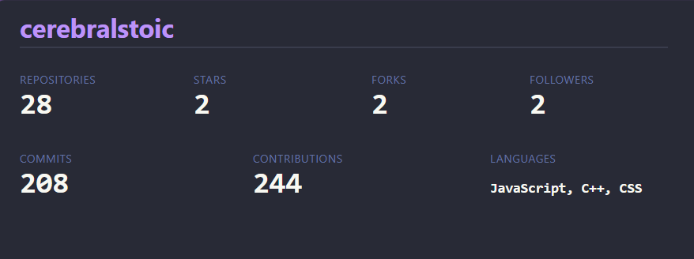
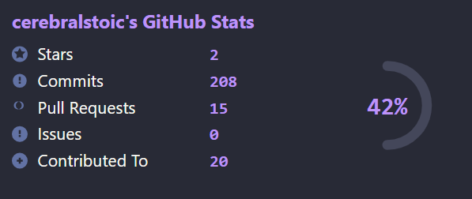
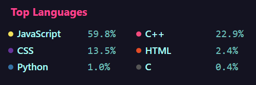
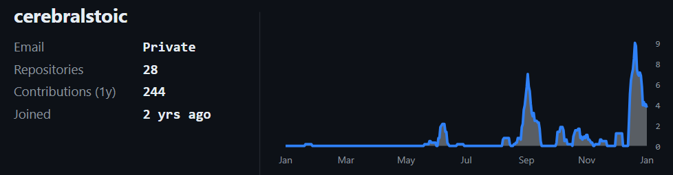

# GitHub README Stats API

A serverless API that generates **dynamic SVG GitHub profile cards** for use directly in GitHub READMEs.

This project is hosted on **Vercel** and powered by the **GitHub GraphQL API**, supporting multiple styles, themes, contribution graphs, and optional all-time commit counts.

---

## Live API Endpoint

```

[https://github-readme-stats-api-omega.vercel.app/api/stats](https://github-readme-stats-api-omega.vercel.app/api/stats)

````

---

##  Features

- Dynamic SVG GitHub stats cards
- Multiple card styles
- Multiple color themes
- Contribution timeline graph (last year)
- Optional all-time commit count
- Top languages card
- Profile summary card
- Built-in caching and rate limiting
- Serverless & fast (Vercel)
- Designed for GitHub README usage

---

##  Basic Usage

```md

````

---

## 🔧 Query Parameters

| Parameter             | Required | Description                    |
| --------------------- | -------- | ------------------------------ |
| `username`            | ✅        | GitHub username                |
| `style`               | ❌        | Card layout style              |
| `theme`               | ❌        | Color theme                    |
| `include_all_commits` | ❌        | Count all commits across repos |

---

##  Styles

Available styles:

```
stats
insight
top-languages
summary
```

Example:

```md

```

---

##  Themes

Available themes:

```
default
radical
dracula
tokyonight
catppuccin
githubdark
sunset
cyberpunk
mono
emerald
pookie
algolia
nord
```

Example:

```md

```

---

##  Include All Commits

By default, commits are calculated using GitHub’s contribution data.

To include **all commits across repositories**:

```md

```

---

##  Top Languages Card

```md

```

---

##  Profile Summary Card

```md

```

Includes:

* Email (if public)
* Repository count
* Contributions (last year)
* Account age
* Contribution timeline graph

---

##  How It Works

* Data fetched via GitHub GraphQL API
* SVGs generated on-demand
* Cached for performance
* Served via Vercel Serverless Functions
* Optimized for GitHub README embedding

---

## 📄 License

MIT License

##  Preview

| Stats | Insight |
|--------|---------|
|  |  |

| Top Languages | Summary |
|--------------|---------|
|  |  |


##  Development Notes

This project is a **serverless API** and does **not** run like a traditional Node/Express server.

### Local Development

1. Install Vercel CLI:
   ```bash
   npm install -g vercel
   
2. Login to Vercel:

   ```bash
   vercel login
   ```

3. Create `.env.local` in the project root:

   ```
   GITHUB_TOKEN=ghp_your_token_here
   ```

4. Start local serverless environment:

   ```bash
   vercel dev
   ```

5. Open in browser:

   ```
   http://localhost:3000/api/stats?username=cerebralstoic
   ```

---
